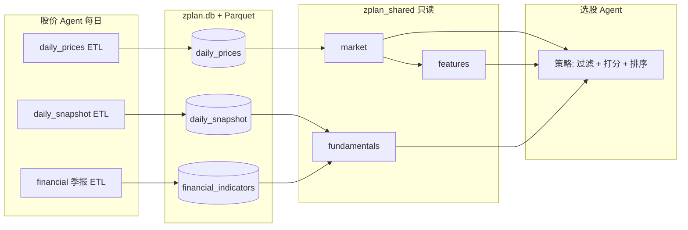

# Z-Plan 行情数据中心架构

> **所有 Agent 开发前请先读本文。** 路径：`zplan-共享/docs/DATA_ARCHITECTURE.md`  
> 实现代码：`zplan_shared.models`（表结构）、`zplan_shared.market`（只读查询）、`zplan_shared.etl_akshare`（写入，仅股价 Agent）。

## Monorepo 目录（中文文件夹名）

| 目录 | Agent | 读写行情库 |
|------|-------|------------|
| `zplan-资讯/` | 资讯 Agent | **只读**（价格上下文） |
| `zplan-共享/` | 共享库（ORM + ETL + 查询 API） | 定义 schema |
| `zplan-股价/` | 股价 Agent | **唯一写入者**（行情域） |
| `zplan-选股/` | 选股 Agent | 只读 |
| `zplan-回测/` | 回测 Agent | 只读 |

数据根目录默认：`zplan-资讯/`（`ZPLAN_ROOT` 可覆盖）。数据库文件：`{ZPLAN_ROOT}/zplan.db`。

---

## 分层原则（不变）

```text
外部源 (AkShare 等)  →  [写入] zplan-股价 ETL  →  zplan.db (+ 可选 Parquet)
                              ↓
                    zplan_shared.market / features（只读）
                              ↓
                    选股 / 回测 / 资讯（禁止直连 AkShare 拉 K 线）
```

- 资讯域表（`news_*`、`global_news`、`financial_alerts` 等）与行情域**同库不同责**。
- **原始事实进库，衍生指标可算可物化**：见下文「选股视角的数据分层」。

---

## 选股视角：当前够吗？

**结论：Phase A 烟测够用，正式选股明显偏薄。**

| 能力 | 选股典型用途 | 当前状态 | 缺口 |
|------|--------------|----------|------|
| 日线 OHLC | 趋势、突破、均线 | 有（5 只 × ~120 日，腾讯源） | 全市场、更长历史、东财完整字段 |
| 成交量 / 换手率 | 放量、流动性过滤 | `volume`/`turnover_rate` 多为空 | 需东财 `stock_zh_a_hist` 或等价源 |
| 涨跌幅 | 动量、涨停池 | `pct_chg` 多为空 | 同上 |
| 估值截面 PE/PB/市值 | 价值、规模因子 | 无 | Phase B `daily_snapshot` |
| 财报 ROE、营收增速 | 质量、成长 | 表已建、无 ETL | Phase D `financial_indicators` |
| 技术指标 MA/MACD/RSI | 策略信号 | **日频快照** `daily_features` | Phase A.2 计算 + A.3 物化 |
| 分钟 / 分时量 | 日内、VWAP | 无 | Phase C（按需） |
| 行业 / 概念 | 板块轮动 | `stock_list.industry` 未填 | Phase B 扩展列表 ETL |
| 资讯 / 情绪 | 事件驱动 | 资讯 Agent 已有 | 选股只读关联，非股价 ETL |

占位选股（`get_panel` + 按 `close` 排序）仅证明链路；**实质选股至少需要：全市场日线 + 完整量价字段 + 估值截面 + 可复用的指标 API**。

---

## 设计原则（循序渐进但不返工）

### 1. 三层数据语义

```text
L0 原始行情 fact     daily_prices, minute_bars(Parquet), daily_snapshot
L1 标的元数据       stock_list（代码、名称、行业、上市日、ST 标记）
L2 衍生特征 feature  由 L0 计算；默认运行时算，瓶颈再物化
L3 策略信号 signal   选股 Agent 内；不入库或仅落调试表
```

- **L0 只存可核对的一手字段**（OHLCV、换手、PE…），带来源 `source` 与 `ingested_at`。
- **L2 技术指标不默认写入 SQLite**：全市场 × 全历史 × 30 个指标会爆炸；用 `zplan_shared.features`（规划）对 `get_bars` / `get_panel` 做向量化计算。
- **需要全市场横截面扫描时**（例如「MA20 上穿且换手>3%」），再增加 **物化表** `daily_features`（Phase A.3，可选）。

### 2. 存储分工

| 数据类型 | 存储 | 原因 |
|----------|------|------|
| 日线、快照、财报 | SQLite `zplan.db` | 行数可控、JOIN 方便、单文件备份 |
| 分钟线 | `{ZPLAN_ROOT}/parquet/minute_bars/` | 体积大，按 `ts_code`/`year` 分区 |
| ETL 运行记录 | `ingest_runs` | 断点续跑、审计 |

### 3. 统一只读入口（选股禁止摸表）

```python
# 已有
from zplan_shared.market import get_bars, get_panel, latest_trade_date, as_of_close

# 规划（L2）
from zplan_shared.features import (
    add_ma, add_macd,           # 单票 Series/DataFrame
    scan_universe,              # 全市场某日截面特征（可走物化表）
)
from zplan_shared.fundamentals import (
    get_snapshot,               # Phase B：PE/PB/市值
    get_financials,             # Phase D：财报指标
)
```

选股 Agent **只依赖上述 API**，不 `import akshare`，不直接 SQL。

### 4. 数据源优先级

| 优先级 | 场景 | 源 |
|--------|------|-----|
| P0 | 日线量价、换手、涨跌幅 | 东财 `stock_zh_a_hist`（`akshare_em`） |
| P1 | 东财限流/断连 | 腾讯 `stock_zh_a_hist_tx`（`akshare_tx`，字段较少） |
| P2 | 估值截面 | 东财个股信息 / 实时行情接口（待 Phase B 选型） |

同一 `(ts_code, trade_date)` 以东财为准；腾讯仅补空缺并保留 `source` 便于清洗。

---

## 分阶段路线图（与实现对齐）

### Phase A — 日线事实层（进行中）

**表：** `daily_prices`（概念名 `daily_bars`），唯一键 `(ts_code, trade_date)`。

| 列名 | 含义 | 来源 |
|------|------|------|
| `ts_code` | 6 位代码 | 列表 ETL |
| `trade_date` | 交易日 | K 线接口 |
| `open/high/low/close` | OHLC | 同上 |
| `volume` | 成交量（手） | 东财 |
| `amount` | 成交额（元） | 东财/腾讯 |
| `amplitude` | 振幅（%） | 东财 |
| `pct_chg` | 涨跌幅（%） | 东财 |
| `change_amt` | 涨跌额 | 东财 |
| `turnover_rate` | 换手率（%） | 东财 |
| `adjust_type` | `qfq` / `hfq` / `none` | ETL 参数 |
| `source` | `akshare_em` / `akshare_tx` | ETL |
| `ingested_at` | 写入 UTC | ETL |

**A.0 已完成：** 链路、upsert 分批、`--init` 烟测、腾讯回退。  
**A.1（已实现，选股最小可用 + 近端分时）：**

- **日线（SQLite）**：全市场东财 `stock_zh_a_hist`，新标的回溯约 400 自然日（≈250 交易日），增量按库内最新日续拉。
- **近端分时（Parquet）**：`{PARQUET_ROOT}/intraday/period={1|5}/ts_code=XXXXXX.parquet`
  - `period=1`：东财 trends2，约 **5 个交易日** 的 **1 分钟** 线（接口上限）。
  - `period=5`：东财 K 线，**14 自然日** 的 **5 分钟** 线（覆盖「最近两周」趋势）。
- **选股融合只读 API**：`get_minute_bars`、`get_pick_context`（分时微观结构 + 48h 资讯命中数）。
- CLI：`cd zplan-股价 && .venv/bin/python main.py --a1 [--init] [--limit N] [--skip-intraday]`

```text
历史趋势          最近两周「精确到时」           舆情/新闻
daily_prices  +  intraday Parquet (1m+5m)  +  financial_alerts / global_news
     │                    │                            │
     └──────── get_pick_context / get_panel ──────────┘
                          选股 Agent
```

**A.2 衍生特征（无新表，优先做）：**

- 新增 `zplan_shared/features.py`：`ma(n)`、`ema`、`macd`、`rsi`、`atr`、`pct_return(n)` 等。
- 输入：`get_bars(ts_code, start=..., end=...)`；输出：原 DataFrame + 指标列。
- 选股侧：`panel = get_panel(); bars = get_bars(...); features = add_ma(bars, 20)`。

**A.3 物化快照（已实现）：**

- 表 `daily_features`：每 `(ts_code, trade_date)` 一行，列与 `features.SNAPSHOT_*_KEYS` 一致。
- 日更：`scripts/materialize_daily_features.py`（批量 `scan_universe_features`，约 1～3 分钟）。
- 只读：`feature_store.get_features_panel(as_of)`；选股扫描优先读表，不足再现场算。

---

### Phase B — 日频估值 / 基本面快照

**表：** `daily_snapshot`（待建）

| 列（示例） | 用途 |
|------------|------|
| `ts_code`, `trade_date` | 主键 |
| `pe_ttm`, `pb`, `ps_ttm` | 估值过滤 |
| `total_mv`, `circ_mv` | 市值因子 |
| `turnover_rate` | 可与日线交叉校验 |
| `source`, `ingested_at` | 溯源 |

**API：** `get_snapshot(as_of=None) -> DataFrame`（对齐 `get_panel` 语义）。

**选股用法：** `panel = get_panel(); snap = get_snapshot(); merged = panel.join(snap, on='ts_code')`。

**ETL：** 股价 Agent 每日一次全市场截面（接口次数远小于 per-symbol K 线）。

---

### Phase C — 分钟线扩展（A.1 已落子集）

A.1 已将 **近 14 日 5 分钟 + 近 5 日 1 分钟** 写入 Parquet；全历史分钟仍按需扩展分区目录。  
**API：** `get_minute_bars(ts_code, period='5'|'1', start=, end=)`。

---

### Phase D — 财报指标

**表：** `financial_indicators`（已存在于 `models.py`）

| 列（现有 + 可扩展） | 用途 |
|---------------------|------|
| `report_date` | 报告期 |
| `pe_ttm`, `pb` | 与 snapshot 互补 |
| `revenue`, `net_profit` | 成长 / 盈利 |
| （扩展）`roe`, `debt_ratio`, `eps_yoy` | 质量因子 |

**频率：** 季报/年报批量更新，非每日全量。  
**API：** `get_financials(ts_code, limit=8) -> DataFrame`（按报告期倒序）。

---

### Phase E — 运行与质量（横切）

**表：** `ingest_runs`

| 字段 | 含义 |
|------|------|
| `job_name` | `daily_prices` / `daily_snapshot` / … |
| `started_at`, `finished_at` | 时间 |
| `status` | ok / partial / failed |
| `rows_upserted`, `symbols_total` | 统计 |
| `error_sample` | 失败样例 JSON |

**质量规则（CI / 烟测）：**

- `latest_trade_date` 不早于「最近交易日 - 3」。
- 随机 10 只股票 `get_bars` 行数 ≥ 200。
- `get_panel()` 行数 ≥ 4000（全市场就绪后）。

---

## 数据流（选股一日工作流）



---

## 只读 API（当前 + 规划）

### 已实现

```python
# zplan_shared.market
get_bars(ts_code, start=..., end=...)
get_panel(as_of=..., fields=...)
get_minute_bars(ts_code, period="5"|"1", start=, end=)
latest_trade_date()
as_of_close(ts_code, as_of)
resolve_ts_code(code)

# zplan_shared.pick_context
get_pick_context(ts_code, news_hours=48)  # 分时特征 + 资讯命中
summarize_recent_intraday(ts_code)
```

### 规划

| 模块 | 函数 | Phase |
|------|------|-------|
| `features` | `add_ma`, `add_macd`, `add_rsi`, `add_atr` | A.2 |
| `features` | `scan_universe(as_of, rules)` | A.3 |
| `fundamentals` | `get_snapshot`, `get_financials` | B, D |

---

## 环境变量

| 变量 | 说明 |
|------|------|
| `ZPLAN_ROOT` | 数据根目录，默认 `../zplan-资讯` |
| `DB_URL` | 默认 `sqlite:///{ZPLAN_ROOT}/zplan.db` |
| `AKSHARE_RATE_LIMIT_SECONDS` | 拉取间隔，默认 2 |
| `AKSHARE_USE_SYSTEM_PROXY` | 默认 `true`（读 macOS 系统代理，如 Clash 7897） |
| `AKSHARE_DIRECT` | `true` 时强制直连、不用代理 |
| `AKSHARE_ALLOW_TX_FALLBACK` | 默认 `false`；**禁止**东财失败时降级腾讯 |
| `PARQUET_ROOT` | 默认 `{ZPLAN_ROOT}/parquet` |
| `DAILY_BOOTSTRAP_CALENDAR_DAYS` | 新标的日线回溯，默认 400 |
| `RECENT_INTRADAY_CALENDAR_DAYS` | 5 分钟线窗口，默认 14 |
| `INTRADAY_FINE_CALENDAR_DAYS` | 1 分钟线窗口，默认 5（东财接口上限） |

---

## 股价 Agent 命令

```bash
cd zplan-股价
./scripts/bootstrap_env.sh
.venv/bin/python main.py --a1 --init --limit 5   # A.1 烟测
.venv/bin/python main.py --a1                    # A.1 全市场（耗时长）
.venv/bin/python main.py --init --limit 5        # 烟测：腾讯日线 only
.venv/bin/python main.py                         # 日线增量
```

---

## 近期实施顺序（建议）

1. **A.1** 全市场日线 + 东财完整字段（阻塞真实选股）。
2. **A.2** `features.py`，选股策略改为「量价 + MA/动量」示例。
3. **B** `daily_snapshot` + `get_snapshot`，支持 PE/市值过滤。
4. **D** 财报 ETL（季报节奏）。
5. **A.3 / C** 按策略需要再上物化特征或分钟线。

文档版本与代码不一致时，以本文 Phase 标注为准，PR 应同步更新本节。
